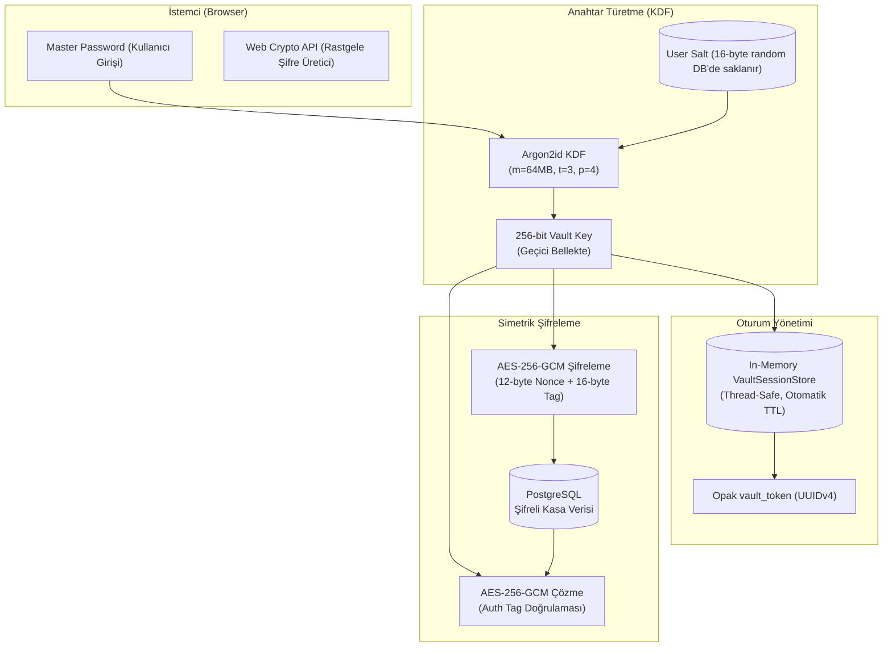

# PassPass — Secure, Modern & Self-Hosted Password Manager 🔐

<div align="center">


<p align="center">
  <b>Uçtan uca güvenli, modern, hafif ve bağımsız barındırılabilir (self-hosted) kişisel şifre yöneticisi.</b>
  <br />
  Master password veya kasa şifreleme anahtarları asla veritabanında saklanmaz.
</p>

[Özellikler](#-özellikler) •
[Güvenlik Mimarisi](#-güvenlik--kriptografi-mimarisi) •
[Teknoloji Stack'i](#️-teknoloji-stacki) •
[Hızlı Başlangıç](#-hızlı-başlangıç--kurulum) •
[API Dokümantasyonu](#-api-referansı) •
[Testler](#-test--doğrulama)

</div>

---

## 🌟 Öne Çıkan Özellikler

- 🛡️ **Zero-Knowledge Yaklaşımı**: Master password ve kasa anahtarı veritabanında **asla** saklanmaz.
- 🔑 **Argon2id KDF**: Kullanıcıya özel 16 baytlık benzersiz salt ile GPU/ASIC saldırılarına karşı yüksek bellek ve zaman maliyetli anahtar türetimi.
- 🔒 **AES-256-GCM Authenticated Encryption**: Her kayıt için benzersiz 12 baytlık rastgele Nonce ve 16 baytlık Auth Tag ile veri bütünlüğü garantisi.
- ⏱️ **İzole & Güvenli Kasa Oturumu**: `vault_key` sunucu tarafındaki thread-safe in-memory oturum deposunda tutulur; istemciye yalnızca kısa ömürlü, opak UUID `vault_token` iletilir.
- 🎲 **Kriptografik Güvenli Şifre Üretici**: Web Crypto API (`crypto.getRandomValues`) tabanlı, özelleştirilebilir uzunluk ve karakter setli güçlü şifre üretimi.
- 📊 **Gerçek Zamanlı Şifre Gücü Ölçer**: Entropi ve karakter dağılımı analizine dayalı anlık güç göstergesi.
- 📋 **Tek Tıkla Pano Kopyalama**: Hassas bilgilerin hızlı ve güvenli kopyalanması.
- 🎨 **Modern Glassmorphism UI**: Vanilla CSS ile hazırlanmış, sıfır harici CSS framework bağımlılığına sahip, karanlık mod odaklı ve tamamen responsive kullanıcı arayüzü.
- 🩺 **Canlı Sağlık & Durum Kontrolü**: Veritabanı ve servis durumunu gerçek zamanlı izleyen `/api/v1/health` uç noktası ve arayüz indikatörü.
- 🧪 **%100 Test Kapsamı**: 104 adet Pytest backend testi (birim + entegrasyon + E2E smoke) ve 77 adet Vitest/RTL frontend testi ile toplam **181 test**.

---

## 🔒 Güvenlik & Kriptografi Mimarisi

PassPass, şifre kasasını korumak için sektör standardı modern kriptografik protokolleri katmanlı bir yapıda uygular:

### Kriptografik Akış Şeması



### Güvenlik Prensipleri Detayı

1. **Master Password KDF (Argon2id)**:
   - Formül: `vault_key = Argon2id(master_password, salt=vault_kdf_salt, memory=64MB, iterations=3, parallelism=4, length=32B)`
   - Master password hash'i (`user.hashed_password`) ile kasa anahtarı (`vault_key`) birbirinden bağımsız adımlarda işlenir.
2. **Kasa Oturumu & Bellek İzolasyonu (`VaultSessionStore`)**:
   - `vault_key`, API yanıtlarında veya veritabanında asla tutulmaz.
   - Yalnızca RAM üzerinde thread-safe bir yapıda tutulur ve kullanıcı çıkış yaptığında derhal bellekten silinir.
3. **AES-256-GCM Kimlik Doğrulamalı Şifreleme**:
   - Her kasa kaydının şifresi ve notu ayrı bir rastgele 12 bayt IV/Nonce ile şifrelenir.
   - 16 baytlık Auth Tag ile veride en ufak bir bit manipülasyonu olması durumunda işlem anında reddedilir.
4. **Kriptografik Rastgelelik (CSPRNG)**:
   - Arayüzdeki şifre üretici hiçbir koşulda `Math.random()` kullanmaz; doğrudan `window.crypto.getRandomValues` ile çalışır.

---

## 🛠️ Teknoloji Stack'i

| Katman | Teknoloji / Kütüphane | Versiyon | Görevi / Açıklama |
| :--- | :--- | :--- | :--- |
| **Frontend** | React | 19.2 | Bileşen tabanlı SPA mimarisi |
| **Frontend** | TypeScript | 6.0 | Tip güvenli kod tabanı |
| **Frontend** | Vite | 8.2 | Ultra hızlı derleme ve HMR geliştirme sunucusu |
| **Frontend** | React Router | 7.1 | İstemci tarafı rota yönetimi & Protected Route koruması |
| **Frontend** | Vanilla CSS | CSS3 | Custom Glassmorphism UI tasarım sistemi, CSS custom properties |
| **Backend** | Python | 3.12+ / 3.14 | Modern, tip tanımlı dinamik programlama dili |
| **Backend** | FastAPI | 0.115+ | Yüksek performanslı asenkron REST API framework'ü |
| **Backend** | SQLAlchemy | 2.0+ | Modern ORM ve declarative veritabanı modellemesi |
| **Backend** | Alembic | 1.13+ | Veritabanı şema versiyonlama ve migration yönetimi |
| **Backend** | Pydantic | 2.7+ | Veri doğrulama, serileştirme ve DTO şemaları |
| **Veritabanı** | PostgreSQL | 16 Alpine | İlişkisel, ACID uyumlu veritabanı servisi |
| **Kriptografi** | Argon2-cffi & Cryptography | 23.1+ / 42.0+ | Argon2id KDF ve AES-256-GCM implementasyonları |
| **Konteyner** | Docker & Compose | v2+ | PostgreSQL için izole ve persistent yerel ortam |
| **Test** | Pytest & Vitest | 8.0+ / 4.1+ | 181 adet otomatik birim, entegrasyon ve smoke testi |

---

## 📁 Proje Dizin Yapısı

```text
passpass/
├── backend/                       # FastAPI REST API Backend Servisi
│   ├── alembic/                   # Veritabanı migration şemaları
│   │   └── versions/              # Migration versiyon dosyaları
│   ├── app/
│   │   ├── api/                   # API katmanı ve rotalar
│   │   │   ├── deps.py            # Bağımlılık enjeksiyonları (get_db, auth, vault_key)
│   │   │   └── routes/            # auth.py, passwords.py, health.py
│   │   ├── core/                  # Çekirdek kriptografi, ayarlar & oturum deposu
│   │   │   ├── config.py          # Pydantic Settings ortam değişkenleri
│   │   │   ├── crypto.py          # Argon2id KDF & AES-256-GCM fonksiyonları
│   │   │   ├── security.py        # Password hashing & JWT işlemleri
│   │   │   └── session.py         # Thread-safe in-memory VaultSessionStore
│   │   ├── db/                    # Engine & SessionLocal bağlantı yapılandırması
│   │   ├── models/                # SQLAlchemy ORM modelleri (User, PasswordEntry)
│   │   ├── repositories/          # Veri tabanı erişim katmanı (Repository Pattern)
│   │   ├── schemas/               # Pydantic girdi/çıktı DTO modelleri
│   │   ├── services/              # İş mantığı katmanı (AuthService, PasswordService)
│   │   └── main.py                # FastAPI app başlatıcı, CORS ve middleware
│   ├── tests/                     # 104 adet Pytest birim/entegrasyon testi
│   │   └── test_e2e_smoke.py      # Canlı sunucu E2E duman testi
│   ├── .env.example               # Backend ortam şablonu
│   ├── alembic.ini                # Alembic yapılandırması
│   └── requirements.txt           # Python paket bağımlılıkları
│
├── frontend/                      # React 19 + TypeScript + Vite İstemcisi
│   ├── src/
│   │   ├── components/            # Yeniden kullanılabilir UI bileşenleri
│   │   │   ├── common/            # Navbar, Toast, Butonlar
│   │   │   └── vault/             # PasswordCard, Generator, StrengthMeter, Modallar
│   │   ├── context/               # AuthContext & Session State yönetimi
│   │   ├── hooks/                 # Custom hook'lar (useAuth, useHealthCheck)
│   │   ├── layouts/               # AppLayout ve sayfa düzenleri
│   │   ├── lib/                   # Fetch tabanlı merkezi api-client
│   │   ├── pages/                 # LoginPage, RegisterPage, VaultPage
│   │   ├── services/              # auth.service.ts, password.service.ts
│   │   ├── test/                  # 77 adet Vitest & Testing Library testi
│   │   ├── types/                 # TypeScript arayüz ve tip tanımları
│   │   ├── utils/                 # password-generator, password-strength
│   │   ├── App.tsx                # Rota tanımları (Public / Protected)
│   │   ├── index.css              # Glassmorphism Design System CSS
│   │   └── main.tsx               # DOM mount entrypoint
│   ├── .env.example               # Frontend ortam şablonu
│   ├── package.json               # Node scriptleri ve paketler
│   ├── tsconfig.json              # TypeScript yapılandırması
│   └── vite.config.ts             # Vite yapılandırması
│
├── docker-compose.yml             # PostgreSQL 16 Alpine konteyneri
├── .env.example                   # Proje kök ortam değişkenleri örneği
├── .gitignore                     # Git tarafından izlenmeyecek dosyalar
└── README.md                      # Proje dokümantasyonu
```

---

## 🚀 Hızlı Başlangıç & Kurulum

### Ön Gereksinimler
- **Docker** ve **Docker Compose**
- **Python 3.12+**
- **Node.js 20+** ve **npm**

---

### Adım 1: Depoyu Hazırlama & PostgreSQL Başlatma

Kök dizindeki `.env.example` dosyasını kopyalayın ve Docker servisini ayağa kaldırın:

```bash
# Kök dizinde:
cp .env.example .env

# PostgreSQL veritabanını arka planda başlatın
docker compose up -d

# Konteyner durumunu kontrol edin
docker compose ps
```

---

### Adım 2: Backend Servisini Çalıştırma

Ayrı bir terminal penceresinde backend dizinine gidin, sanal ortamı kurun ve sunucuyu başlatın:

```bash
cd backend

# Ortam değişkenlerini kopyalayın
cp .env.example .env

# Python sanal ortamı oluşturun ve aktif edin
python3 -m venv .venv
source .venv/bin/activate  # Windows için: .venv\Scripts\activate

# Bağımlılıkları yükleyin
pip install -r requirements.txt

# Veritabanı şemasını uygulayın (Alembic)
alembic upgrade head

# Geliştirme sunucusunu başlatın
uvicorn app.main:app --reload --host 0.0.0.0 --port 8000
```

- 🌐 **Backend API**: [http://localhost:8000](http://localhost:8000)
- 📚 **Swagger UI Dokümantasyonu**: [http://localhost:8000/docs](http://localhost:8000/docs)
- 📖 **ReDoc Dokümantasyonu**: [http://localhost:8000/redoc](http://localhost:8000/redoc)

---

### Adım 3: Frontend İstemcisini Çalıştırma

Ayrı bir terminal penceresinde frontend dizinine gidin ve Vite geliştirme sunucusunu başlatın:

```bash
cd frontend

# Ortam değişkenlerini kopyalayın
cp .env.example .env

# Bağımlılıkları yükleyin
npm install

# Geliştirme sunucusunu başlatın
npm run dev
```

- 🖥️ **Web Arayüzü**: [http://localhost:5173](http://localhost:5173)

---

## 📡 API Referansı

Tüm API uç noktaları `/api/v1` önekiyle sunulur. İnteraktif test için [http://localhost:8000/docs](http://localhost:8000/docs) adresini ziyaret edebilirsiniz.

### Kimlik Doğrulama (`/api/v1/auth`)

| Metot | Uç Nokta | Yetkilendirme | Açıklama |
| :--- | :--- | :---: | :--- |
| `POST` | `/api/v1/auth/register` | Yok | Yeni kullanıcı kaydı oluşturur, benzersiz KDF salt üretir. |
| `POST` | `/api/v1/auth/login` | Yok | Giriş yapar; `access_token` (JWT) ve `vault_token` döndürür. |
| `POST` | `/api/v1/auth/logout` | `Bearer` + `Vault-Token` | Kasa oturum anahtarını bellekten temizler ve oturumu kapatır. |
| `GET` | `/api/v1/auth/me` | `Bearer` | Aktif kullanıcının profil bilgilerini getirir. |

### Şifre Kasası (`/api/v1/passwords`)

| Metot | Uç Nokta | Yetkilendirme | Açıklama |
| :--- | :--- | :---: | :--- |
| `GET` | `/api/v1/passwords` | `Bearer` | Kullanıcının kasa özet listesini getirir (şifreler kapalı döner). |
| `POST` | `/api/v1/passwords` | `Bearer` + `Vault-Token` | Yeni şifre kaydını AES-256-GCM ile şifreleyerek kasaya ekler. |
| `GET` | `/api/v1/passwords/{id}` | `Bearer` + `Vault-Token` | Belirtilen kaydı çözer (`decrypted`) ve detayları döndürür. |
| `PUT` | `/api/v1/passwords/{id}` | `Bearer` + `Vault-Token` | Mevcut kaydı günceller ve yeniden şifreler. |
| `DELETE` | `/api/v1/passwords/{id}` | `Bearer` | Kaydı kasadan kalıcı olarak siler. |

### Sistem Sağlığı (`/api/v1/health`)

| Metot | Uç Nokta | Yetkilendirme | Açıklama |
| :--- | :--- | :---: | :--- |
| `GET` | `/api/v1/health` | Yok | API ve PostgreSQL veritabanı bağlantı durumunu kontrol eder. |

---

## ⚙️ Ortam Değişkenleri (Environment Variables)

### Kök Dizin (`.env`)
```ini
POSTGRES_USER=passpass
POSTGRES_PASSWORD=passpass_dev_secret
POSTGRES_DB=passpass_db
POSTGRES_PORT=5432
```

### Backend (`backend/.env`)
```ini
PROJECT_NAME="PassPass API"
API_V1_STR="/api/v1"
DEBUG=True

POSTGRES_SERVER=localhost
POSTGRES_PORT=5432
POSTGRES_USER=passpass
POSTGRES_PASSWORD=passpass_dev_secret
POSTGRES_DB=passpass_db

CORS_ORIGINS=["http://localhost:5173","http://127.0.0.1:5173"]

JWT_SECRET_KEY=change-me-to-a-random-secret
JWT_ACCESS_TOKEN_EXPIRE_MINUTES=30
```

### Frontend (`frontend/.env`)
```ini
VITE_API_BASE_URL=http://localhost:8000
```

---

## 🧪 Test & Doğrulama

Uygulama genelinde toplam **181 adet otomatik test** bulunmaktadır.

### Backend Testleri (Pytest & E2E Smoke)

```bash
cd backend
source .venv/bin/activate

# 104 adet backend birim, servis ve güvenlik testini çalıştırın
pytest tests/ -v

# Canlı backend çalışırken uçtan uca smoke testini çalıştırın
python tests/test_e2e_smoke.py
```

### Frontend Testleri, Lint ve Derleme (Vitest, TSC, Oxlint)

```bash
cd frontend

# 77 adet Vitest bileşen, utils ve entegrasyon testini çalıştırın
npm test

# Oxlint ile statik kod kalitesi analizi yapın
npm run lint

# TypeScript tip denetimi ve production build testi
npm run build
```

---

## 🛡️ Güvenlik Önerileri & Production Notları

1. **HTTPS / TLS**: Production ortamında tüm istemci-sunucu trafiği mutlaka TLS 1.3 / HTTPS üzerinden geçmelidir.
2. **Güçlü Master Password**: Master password hiçbir yerde saklanmadığı için unutulması durumunda kasa kurtarılamaz.
3. **Gizli Anahtarlar**: Production'da `backend/.env` içerisindeki `JWT_SECRET_KEY` ve PostgreSQL parolalarını rastgele 64 karakterli güvenli dizgilerle değiştirin.
4. **CORS Sıkılaştırma**: `CORS_ORIGINS` alanını yalnızca uygulamanın yayınlandığı domain ile sınırlandırın.

---

## 📄 Lisans

Bu proje [MIT Lisansı](LICENSE) kapsamında lisanslanmıştır. Kişisel veya ticari amaçlarla özgürce kullanılabilir, değiştirilebilir ve dağıtılabilir.
